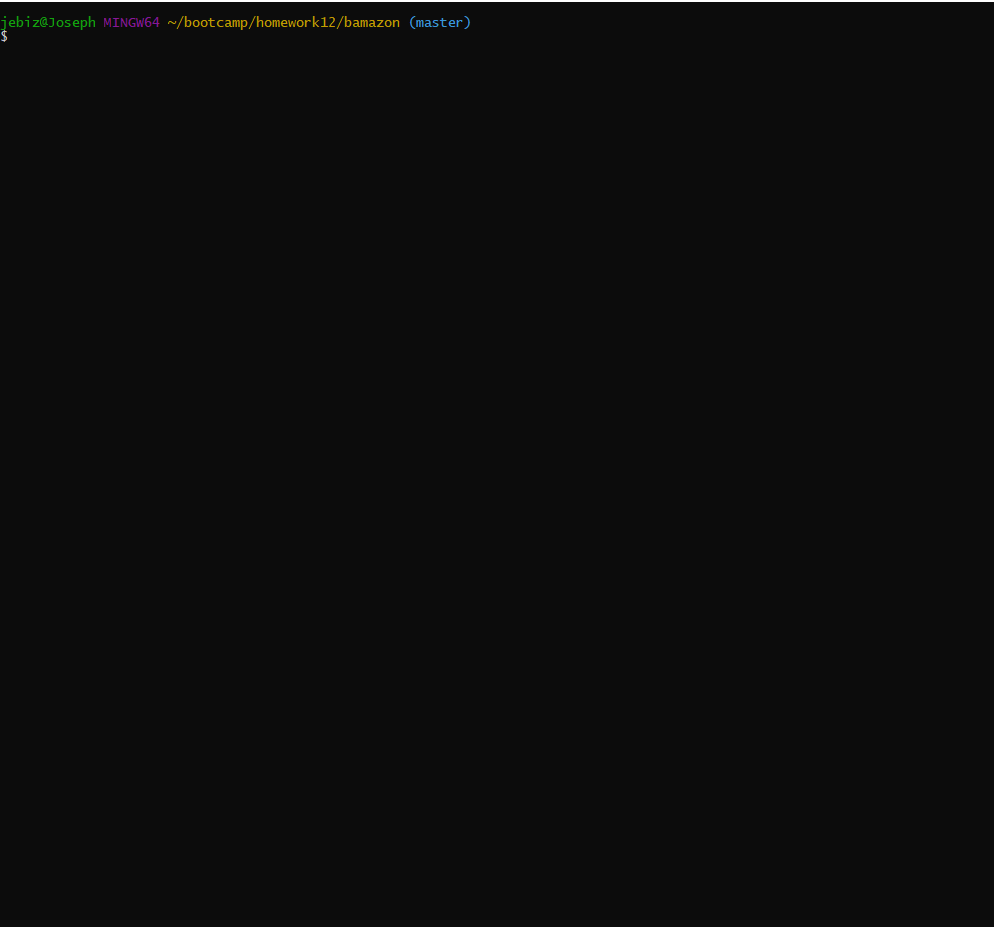

# bamazon

This app allows construction of sql database with predefined table.  
From there, using node.js we can inquire about the table update it through the CLI.  

Open sql file and load to create database.

Run javascript file in node

Generates predefined table via sql database. Inquire statements let you pick what you want to purchase and updates tables.

